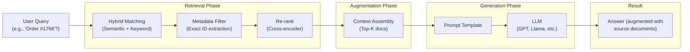

# RAG Learning Tutorial: From First Principles to Production

Welcome! This is a comprehensive, math-first learning path for understanding **Retrieval-Augmented Generation (RAG)**, with a deep focus on solving real-world problems like **exact match vs semantic search** in knowledge bases.

## What You'll Learn

This tutorial takes you from **complete beginner** to **confident implementer** across three tracks:

### 🧮 **Track 1: Math Foundations**
- Linear algebra (vectors, dot products, matrices)
- Distance metrics and similarity measures
- Probability and TF-IDF scoring
- Why the math matters in search systems

### 🔎 **Track 2: How RAG Works**
- What embeddings are (and why they work)
- How similarity search finds relevant documents
- Why semantic search alone fails for IDs and exact matches
- Hybrid search: combining semantic + keyword search
- Real-world chunking and metadata filtering strategies

### 🛠️ **Track 3: Building RAG Systems**
- Vector databases and approximate nearest neighbor algorithms
- Complete ingestion and retrieval pipelines
- Evaluation metrics (relevance, faithfulness, latency)
- Production considerations and trade-offs

## The Motivating Problem

You asked a great question:

> **In a RAG system with similarity search, how do you make sure that when someone searches for an exact ID like "Order #1766", it doesn't return a similar one like "Order #1767" just because they look alike?**

This entire tutorial builds toward solving this problem. Along the way, you'll understand:

- Why semantic embeddings treat `1766` and `1767` as nearly identical
- How hybrid search (BM25 + semantic) fixes this
- How metadata filtering and chunking strategies prevent identity loss
- When to use exact keyword match vs semantic meaning

## Learning Path

**Start here** depending on your background:

- **Math rusty?** → Begin with [Prerequisites: Linear Algebra](00-prerequisites/linear-algebra.md)
- **Familiar with ML?** → Jump to [What are Embeddings](01-embeddings/what-are-embeddings.md)
- **Want the big picture first?** → Read [Understanding Embeddings](01-embeddings/index.md) then [RAG Architecture](05-rag-pipeline/index.md)
- **Just want solutions?** → Go to [The Exact Match Problem](04-exact-match/index.md)

## Architecture Overview

## Key Insights You'll Gain

| Challenge | Solution | Section |
|-----------|----------|---------|
| Semantic search treats similar IDs as equivalent | Hybrid search + metadata filtering | [Exact Match Problem](04-exact-match/index.md) |
| Text embeddings lose structured info like numbers | Careful chunking to preserve token boundaries | [Chunking Strategies](04-exact-match/chunking-strategies.md) |
| How do we find data fast with millions of vectors? | Approximate Nearest Neighbor (ANN) algorithms like HNSW | [Exact vs Approximate Search](02-similarity-search/exact-vs-ann.md) |
| Which distance metric should I use? | Cosine similarity for normalized embeddings (most common) | [Distance Metrics](02-similarity-search/distance-metrics.md) |
| How do I know my RAG system is working? | Evaluation metrics: faithfulness, relevance, latency | [Evaluation](05-rag-pipeline/evaluation.md) |

## Topics Covered

### **Section 00: Prerequisites**
- Linear algebra (vectors, dot product, norms)
- Probability and statistics foundations
- Understanding basic neural network concepts

### **Section 01: Understanding Embeddings**
- Text → numbers: the intuition
- Embedding models (Word2Vec, BERT, Sentence Transformers)
- Vector spaces and dimensions
- Why embeddings capture meaning

### **Section 02: Similarity Search**
- Distance metrics (Cosine, Euclidean, Dot Product) with full derivations
- Exact brute-force search vs Approximate Nearest Neighbor
- Vector databases and performance trade-offs
- HNSW, IVF, and other indexing algorithms

### **Section 03: Retrieval Methods**
- Dense retrieval (semantic / bi-encoder search)
- Sparse retrieval (BM25, TF-IDF)
- Hybrid search (combining both)
- Metadata filtering and structured queries
- Re-ranking with cross-encoders

### **Section 04: The Exact Match Problem**
- Why semantic search fails for exact identifiers
- Order #1766 vs Order #1767 case study
- Hybrid search solutions
- Chunking strategies to preserve identity
- Practical implementation examples

### **Section 05: RAG Pipeline**
- Complete architecture: ingestion → retrieval → augmentation → generation
- Chunking strategies for different document types
- Prompt engineering for augmentation
- Context window management
- Evaluation frameworks and metrics

## How to Use This Tutorial

1. **Read sequentially** (recommended for first-time learners): Start with prerequisites, progress through each section.
2. **Jump to topics** (if you have specific questions): Use the search feature or navigate directly.
3. **Implement along**: Each section includes conceptual explanations and pseudo-code; implement in Python, JavaScript, or your language.
4. **Revisit the math**: Don't skip the mathematical sections—they explain WHY things work, not just HOW.

## Prerequisites You Should Have

- **Basic Python** (numpy arrays, loops, functions)
- **High school algebra** (solving for x, exponents, logarithms)
- **General ML intuition** (you said you have this!)
- **Curiosity about how things actually work**

You do NOT need:
- Advanced linear algebra
- PhD-level statistics
- Deep learning expertise
- Experience with transformers

## Next Steps

👉 **[Start with Prerequisites if math is rusty →](00-prerequisites/index.md)**

👉 **[Or jump to Embeddings for the core concepts →](01-embeddings/index.md)**

---

**Questions or feedback?** Each section has reference materials and citations at the bottom.

Happy learning! 🚀
